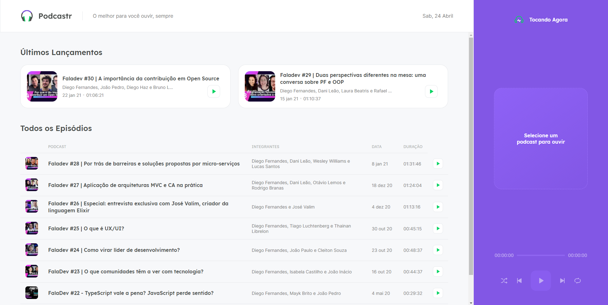
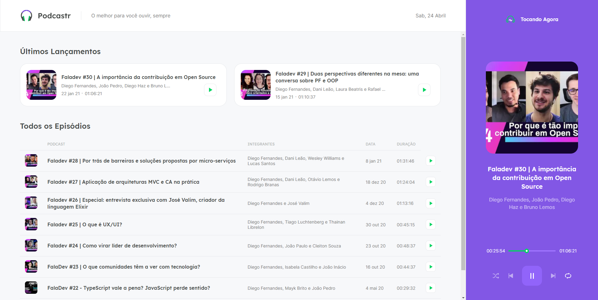
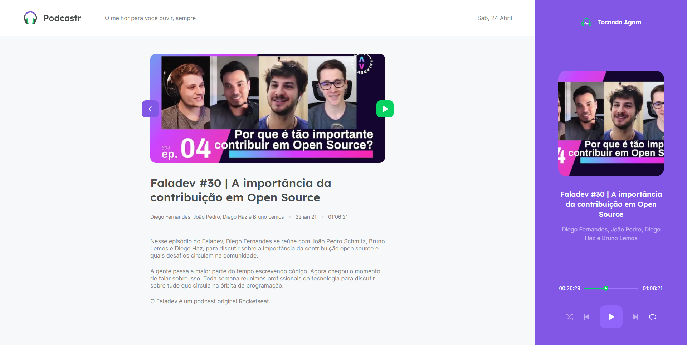

# Podcastr 

<p align="center">
  <a href="#sobre-o-podcastr">Projeto</a>&nbsp;&nbsp;&nbsp;|&nbsp;&nbsp;&nbsp;
  <a href="#telas">Telas</a>&nbsp;&nbsp;&nbsp;|&nbsp;&nbsp;&nbsp;
  <a href="#tecnologias">Tecnologias</a>&nbsp;&nbsp;&nbsp;|&nbsp;&nbsp;&nbsp;
  <a href="#instalação-e-uso">Instalação e Uso</a>
</p>

## Sobre o Podcastr

  
O Podcastr é um App para listagem e reprodução do podcast FalaDev, produzido pela [Rocketseat](https://rocketseat.com.br/).
Desenvolvido durante a Next Level Week #5, organizado pela [Rocketseat](https://rocketseat.com.br/).

### Telas
#### Página Inicial
<p align="center">
  
</p>
  
<hr>

#### Podcast Tocando
<p align="center">
  
</p>
<hr>

#### Página do Episódio
<p align="center">
  
</p>

## Tecnologias

Tecnologias utilizadas no desenvolvimento do projeto:

-  [React](https://reactjs.org/)

-  [TypeScript](https://www.typescriptlang.org/)

-  [NextJS](https://nextjs.org/)

<br>

## Instalação e uso

### Requisitos

- É necessário que tenha instalado [Yarn](https://yarnpkg.com/) para rodar o projeto.

**Clone o projeto com o comando abaixo e acesse a pasta**
```bash

$ git clone https://github.com/LeandroFilie/podcastr-nlw5

$ cd podcastr-nlw5
```

**Siga os passos a seguir**

```bash

# Instalar todas as dependências

$ yarn

# Iniciar o fake back-end

$ yarn server

# Rodar a aplicação em um servidor web

$ yarn dev

```
Acesse o App pelo seu navegador pelo endereço: `http://localhost:3000`

<br>

---
Feito com :heart: by [Leandro Filié](https://github.com/LeandroFilie)
